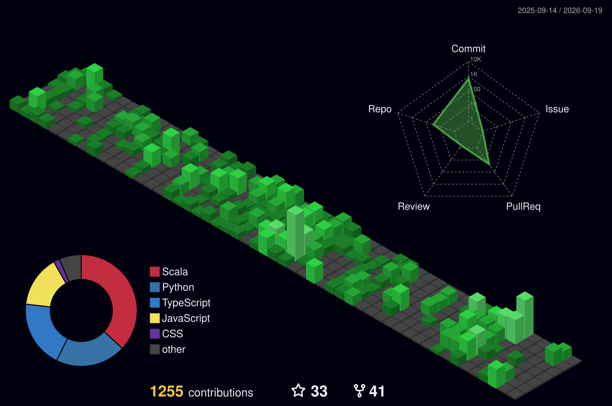

<h1 align="center">Hi 👋, I'm Dharanish A M</h1>
<h3 align="center">Software Engineer building scalable solutions across full-stack, cloud, and AI systems.</h3>

  

---

## 🚀 About Me

- 🔭 Currently building **[AlgoLog](https://github.com/Dharanish-AM/AlgoLog)**
- 🌱 Learning **Scala**
- 💬 Focused on **Full-Stack Engineering, Cloud Systems, and AI-powered products**

### 📌 Snapshot

| Area | Details |
| --- | --- |
| Portfolio | [portfolio-amd.vercel.app](https://portfolio-amd.vercel.app/) |
| Email | dharanish816@gmail.com |
| Resume | [View Resume](https://drive.google.com/drive/folders/1a5rBF_rjfWaL7O9xr0mE3t9rFzMIcxNo?usp=sharing) |
| Core Stack | React, React Native, Node.js, Spring Boot, MongoDB, SQL |

### 🎯 Current Goals

- Build production-grade systems with strong performance and reliability.
- Deepen cloud-native architecture and system design skills.
- Expand applied AI engineering in real-world apps.

---

## 🌐 Connect with Me

<table align="center">
  <tr>
    <td align="center">
      
    </td>
    <td align="center">
      
    </td>
  </tr>
</table>

---

## 🛠️ Tech Stack

### Languages

### Frontend

### Backend and Cloud

### Databases and Messaging

### Tooling and DevOps

### Testing & QA

### Observability & Monitoring

### Security & Auth

---

## 📊 GitHub Stats

  
  

  

---

## 📈 Activity Graph

  

---

## 🐍 Contribution Snake

  

## 🧊 3D Contribution Calendar

 

---

⭐ If you find my work helpful, consider leaving a star!

